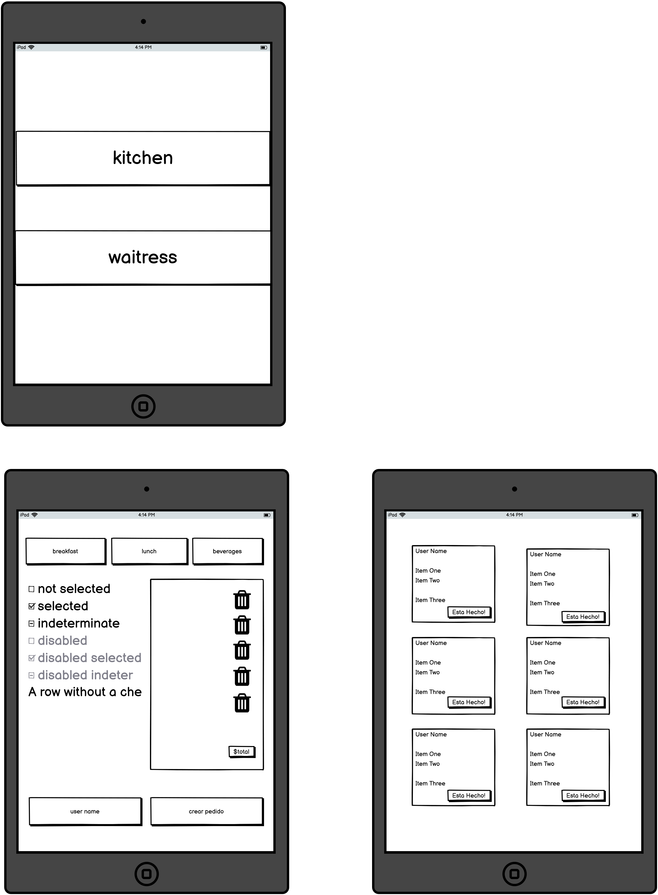

Vegan Queen

1. Definición del Producto

Es una aplicación web para un restaurante con necesidad de poder agilizar la toma, gestión y entrega de pedidos, esta diseñada para usarse en dispositivos tipo tablet. Almacenando los datos en el servidor de firebase y actulizandoce en tiempo real.

El meserx crea el pedido con nombre del cliente y número de mesa, toma el pedido, lo envia a  cocina para ser preparado y el equipo de cocina puede interactuar con el estado de pedido segun esten listos para ser entregados al comenzal.

Historia de Usuario
1. Mesero/a debe poder tomar pedido de cliente

Yo como meserx quiero tomar el pedido de un cliente para no depender de mi mala memoria, para saber cuánto cobrar, y enviarlo a la cocina para evitar errores y que se puedan ir preparando en orden.
Criterios minimos de aceptación

    Anotar nombre de cliente.
    Agregar productos al pedido.
    Eliminar productos.
    Ver resumen y el total de la compra.
    Enviar pedido a cocina (guardar Firebase v-9).
    Se ve y funciona bien en una tablet.

Definición de terminado

    Identificar el cliente y crear nueva mesa.
    Ruta de menú implementada.
    Menú Json creado y accesible.
    Al seleccionar el pedido, de forma interactiva se visualiza los productos y el total del pedido.
    El pedido se envía a la colección firestore "orders".
    Cada pedido se puede visualizar en la sección de Pedidos, resumen que consta con nombre del cliente, número de mesa, nombre del mesero o mesera y productos pedidos con su respectiva cantidad y precio y el total.
    Diseño de interfaz terminado.

    Historia de usuario 2 Jefe de cocina debe ver los pedidos

Yo como jefx de cocina quiero ver los pedidos de los clientes en orden y marcar cuáles están listos para saber qué se debe cocinar y avisar a lxs meserxs que un pedido está listo para servirlo a un cliente.
Criterios de aceptación

    Ver los pedidos ordenados según se van haciendo.
    Marcar los pedidos que se han preparado y están listos para servirse.
   

Definición de terminado

    Debes haber recibido code review de al menos una compañera.
    Haces test unitarios y, además, has testeado tu producto manualmente.
    Hiciste tests de usabilidad e incorporaste el feedback del usuario.
    Desplegaste tu aplicación y has etiquetado tu versión (git tag).

Historia de usuario 3 Meserx debe ver pedidos listos para servir

Yo como meserx quiero ver los pedidos que están preparados para entregarlos rápidamente a los clientes que las hicieron.
Criterios de aceptación

    Ver listado de pedido listos para servir.
    Marcar pedidos que han sido entregados.

Definición de terminado

    Debes haber recibido code review de al menos una compañera.
    Haces test unitarios y, además, has testeado tu producto manualmente.
    Hiciste tests de usabilidad e incorporaste el feedback del usuario.
    Desplegaste tu aplicación y has etiquetado tu versión (git tag).
    Los datos se deben mantener íntegros, incluso después de que un pedido ha terminado. Todo esto para poder tener estadísticas en el futuro.

Prototipo

Herramientas

    React.js.
    JavaScript ES6.
    Firebase v9.
    Balsamiq
    Styled-component
    Css
    HTML 5
    Github Project.
